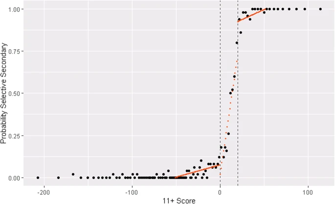
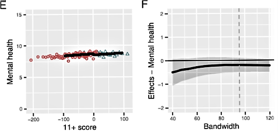

```{r setup, include=FALSE}
knitr::opts_chunk$set(echo = FALSE)

library("tidyverse")
library("ggthemes")
df<- tibble(running=1:1000,
              gs=if_else(running < 501, 0, 1))
rct1 <- df %>%
ggplot(aes(x=running, y=gs)) +
  geom_point() +
  labs(x="Random Number",
       y="Grammar school place (probability)") +
  geom_segment(aes(x=500, y = 0, xend = 500, yend = 1), 
               colour="red") +
  theme(legend.title = element_text(size=18),
        legend.text = element_text(size=18)) 

rct2 <- df %>%
  ggplot(aes(x=running, y=gs)) +
  geom_point() +
  geom_segment(aes(x=10, y = 0.5, xend = 990, yend = 0.5),
               colour="blue") +
  annotate("label", y=0.55, x=500, label="Outcome") +
  labs(x="Random Number",
       y="Grammar school place (probability)") +
  theme(legend.title = element_text(size=18),
        legend.text = element_text(size=18)) 
  
rct3 <- df %>%
  ggplot(aes(x=running, y=gs)) +
  geom_point() +
  geom_segment(aes(x=10, y = 0.3, xend = 500, yend = 0.3),
               colour="blue") +
  geom_segment(aes(x=501, y = 0.7, xend = 990, yend = 0.7),
               colour="blue") +
  geom_segment(aes(x=500, y = 0.3, xend = 500, yend = 0.7),
               colour="blue", linetype=3) +
  annotate("label", y=0.5, x=510, label="Effect") +
  labs(x="Random Number",
       y="Grammar school place (probability)") +
  theme(legend.title = element_text(size=18),
        legend.text = element_text(size=18)) 


  
os1 <- df %>%
ggplot(aes(x=running, y=gs)) +
  geom_point() +
  labs(x="Exam score",
       y="Grammar school place (probability)") +
  geom_segment(aes(x=500, y = 0, xend = 500, yend = 1),
               colour="red") +
  theme(legend.title = element_text(size=18),
        legend.text = element_text(size=18)) 

os2 <- df %>%
ggplot(aes(x=running, y=gs)) +
  geom_point() +
  labs(x="Exam score",
       y="Grammar school place (probability)") +
  geom_segment(aes(x=10, y = 0.02, xend = 990, yend = 0.98),
                 colour="blue") +
  annotate("label", y=0.55, x=700, label="Outcome") +
  theme(legend.title = element_text(size=18),
        legend.text = element_text(size=18)) 

os3 <- df %>%
  filter(between(running,495,505)) %>%
ggplot(aes(x=running,  y=gs)) +
  geom_point() +
  labs(x="Exam score",
       y="Grammar school place (probability)") +
  geom_segment(aes(x=495, y = 0.5, xend = 505, yend = 0.5),
               colour="blue") +
  annotate("label", y=0.55, x=500, label="As random") +
  annotate("label", y=0.05, x=497, label="Zoomed in") +
  theme(legend.title = element_text(size=18),
        legend.text = element_text(size=18)) 

os4 <- df %>%
  filter(between(running,495,505)) %>%
ggplot(aes(x=running,  y=gs)) +
  geom_point() +
  labs(x="Exam score",
       y="Grammar school place (probability)") +
  geom_segment(aes(x=495, y = 0.35, xend = 505, yend = 0.65),
               colour="blue") +
  annotate("label", y=0.55, x=500, label="Continuity") +
  theme(legend.title = element_text(size=18),
        legend.text = element_text(size=18)) 


```

## Outline

-   Overview of Regression Discontinuity (RD)

-   Real world example from own work

## RD

-   Originates in education

-   Thistlethwaite DL, Campbell DT. Regression-discontinuity analysis: an alternative to the ex post facto experiment. [J Educ Psychol. 1960;51:309--317.](https://pdfs.semanticscholar.org/0ebb/29615b1569e9ee219f536c9ad64ae5fce36d.pdf)

-   2 Elements. 1) Running or forcing variable 2) Threshold or cut-point.

## Education (and health) examples

[Systematic review](https://journals.lww.com/epidem/Fulltext/2021/01000/Regression_Discontinuity_Designs_in_Health__A.12.aspx)

-   [Age](https://www.nber.org/system/files/working_papers/w21610/w21610.pdf) - school starting age, effect of starting school older

-   [Year](https://academic.oup.com/restud/article-abstract/72/1/189/1582636) - compulsory schooling laws, effect of education

-   [Class size](https://www.tandfonline.com/doi/full/10.1080/09645292.2013.789826?needAccess=true) - effect of class size, threshold of 25.

-   [Number of schools](https://onlinelibrary.wiley.com/doi/abs/10.1002/hec.1643) - effect of school HIV teaching, towns with 1 to 4 secondary schools

-   [Test score](https://bmcmedicine.biomedcentral.com/track/pdf/10.1186/s12916-020-01536-7.pdf) - effect of grammar school, 11 plus exam

## Randomised intervention as RD

```{r rct1}

rct1

```

## Randomised intervention as RD

```{r rct2}

rct2

```

## Randomised intervention as RD

```{r rct3}

rct3

```

## Non randomized intervention as RD

```{r os1}

os1

```

## Non randomized intervention as RD

```{r os2}

os2

```

## Non randomized intervention as RD

```{r os3}

os3

```

## Non randomized intervention as RD

```{r os4}

os4

```

## Summary

-   RD treatment effect is local to cut-point

-   As random based on "measurement error"

-   Continuity based on smooth null relationship of outcome across cut point

-   Bandwidth is running score band either side of cut-point, wider gives more cases but may increase bias.

-   [Further reading](https://rdpackages.github.io/references/Cattaneo-Idrobo-Titiunik_2019_CUP.pdf) and [here](A%20Practical%20Introduction%20to%20Regression%20Discontinuity%20Designs:%20Foundations.)

## Example

-   [Grammar schooled socio-economically advantaged in adulthood.](https://www.iser.essex.ac.uk/publications/working-papers/iser/2014-05)

-   Translate into health benefits?

-   1960s Aberdeen pupils took 11 plus type test

-   [Aberdeen cohort followed and linked to health data](https://www.abdn.ac.uk/birth-cohorts/1950s/)

-   [Registered report](https://www.cos.io/initiatives/registered-reports)

## Example



## Example



## Thanks for listening

Talk and code here
